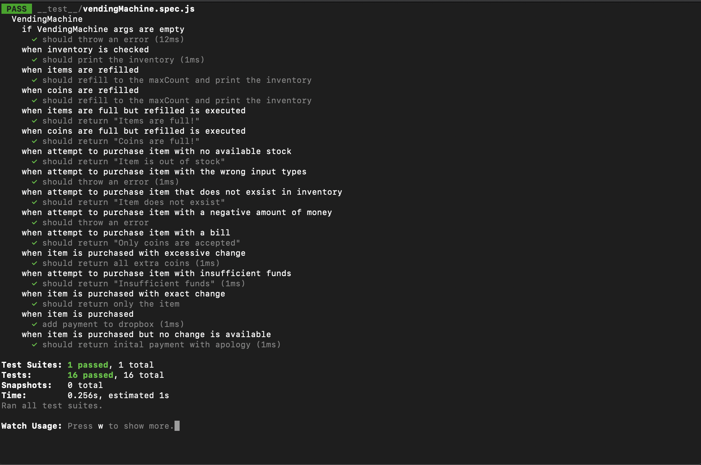

# Vending Machine 🍫

This is a project that emulates a real life vending machine and its processes. It is a common take home project that employers use to test the skill of developers. I used a [JavaScript](https://www.javascript.com/) class to replicated the qualities of a vending machine. Using a combination of methods, properties, mock data, and tests using the [Jest](https://jestjs.io/) I created my very first virtual vending machine!

## Installation Instructions

Follow the instructions below to test the application in on your local device.

### Installation

```bash
npm install
```

### Test

```bash
npm test -- --watchAll
```

## Technologies Used

### JavaScript

- A popular, high-level, lightweight, object oriented language.

```
// A simple class instantiation

class VendingMachine {
    constructor(params){
        this.something = params
    }

    myMethod(someOtherParams){
        return (results of doing something with someOtherParams)
    }
}

const newMachine = new VendingMachine(args)
```

### Node.js

- A JavaScript based, open-source server environment. Using Node.js one can access NPM, Node Package Manager, which host a plethora of open source projects and repositories that you can utilize in your code.

```
const http = require('http');

const hostname = '127.0.0.1';
const port = 3000;

const server = http.createServer((req, res) => {
  res.statusCode = 200;
  res.setHeader('Content-Type', 'text/plain');
  res.end('Hello World');
});

server.listen(port, hostname, () => {
  console.log(`Server running at http://${hostname}:${port}/`);
});
```

Lisenting to a basic Node.js server from [Node.js](https://nodejs.org/en/docs/guides/getting-started-guide/)

### Jest.js

- A JavaScript library to expedite unit testing. It aims to be configuration free and works with Babel, TypeScript, Node, React, Angular, Vue, and more. The unit tests syntax is made to look like a regular sentence.

```
const myFunc = require('../myFunc.js)

describe('A new testing block', () => {
    describe('when doing a specific test', () => {
        it('should do something', () => {
            expect(myFunc()).toBe('what I expect my test
            resulsts to yeild')
        })
    })
})
```

#### My tests:



### JSON

- JavaScript Object Notation is a common open source file format used across many applications. It is built with key:value pairs like a JavaScript object.

```
// A simple JSON file

{
    'key':'value',
    'key': [
        'key':'value',
        'key':'value',
            {
            'key':'value'
            }
    ],
    'key':'value'
}
```

## Personal Learnings

This project has taught me the value of Test Driven Development and how to develop with complete code coverage in mind. It challenged me to expand how I think functions will execute with an unknown amount or type of inputs and how to react to both.

This was reinforced by using the Jest library. Although it does have extensive documentation, I found there to be issue with class instantiation, my mock data, and the built in `beforeEach()` functionality. The `beforeEach()` function should have instantiated a new class with my mock data every instance of a describe block. According to my mock data, each describe block referred to one instance of mock data, not a new instance in each block - what I presumed my `beforeEach()` function would have executed. In order to circumvent this, I had to alter my inputs so different sections of the data was tested independant of other tests. I am not sure if this is an issue with my class, the Jest library, or my mock data, regardless, my tests pass.

I was also challenged with the time frame in mind. This project had a short timeline, similar to what I imagine coding interviews or actual client projects will be like in the near future for myself.
